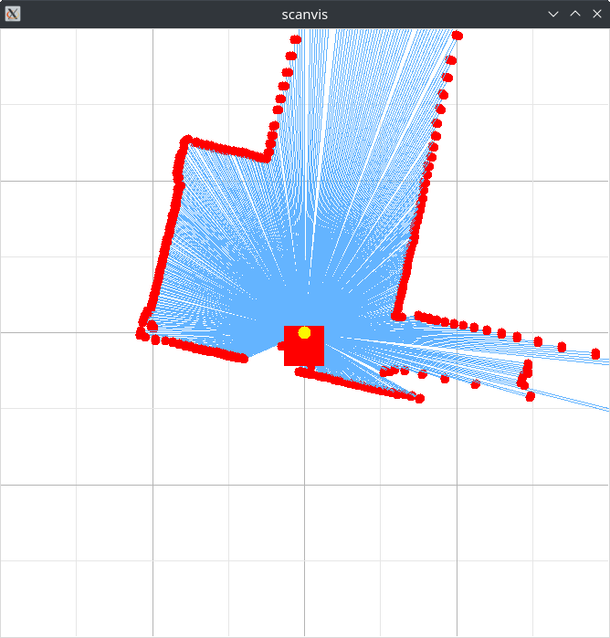

# simplevis
Simple utilities built on ROS2 for visualizing messages
### Installation
```bash
# cd into your ROS2 workspace's src directory
cd ~/ros2_ws/src

# Clone repo
git clone https://github.com/MaxAve/simplevis.git

# Return to workspace
cd ..

# Install dependencies
rosdep install -i --from-path src --rosdistro humble -y

# Build package (note: run colcon build if the package can't be found)
colcon build --packages-select simplevis

# Source workspace
source install/setup.bash

# Run a node in simplevis to test the installation
ros2 run simplevis <node>
```
### scanvis
Visualizes output from the ```/scan``` topic\
\
Run with
```
ros2 run simplevis scanvis
```